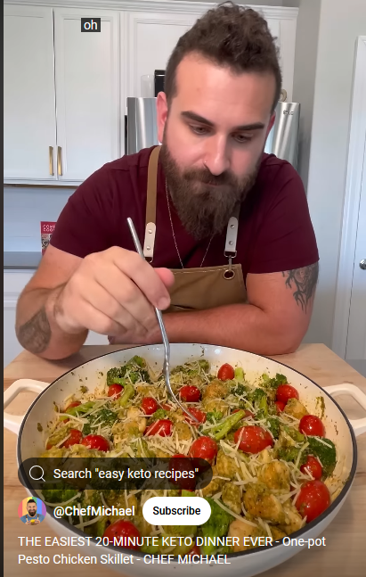

# 20 minutes meal

 

- [20 minutes meal recipe source](https://www.youtube.com/shorts/khE8HNWV1fI)

## Description

QUICK, EASY, CHEAP, AND HEALTHY! In 20 minutes, you’ll have a yummy, simple meal 
that’s not only delicious, but it’s cheap to make and keto! This is also a fantastic 
way to use up whatever vegetables you have in the fridge. Instead of broccoli and tomatoes, 
this also goes really well with sliced asparagus, mushrooms, or any other veggies you may have.

 

  

## Sastojci

Cooking recipe and ingredients:

#### Fry until golden brown.
- Pola pakovanje belog mesa.
- 200 g Brokolija.
- Cherry paradajz
- Pesto genoveze

 Instead of broccoli and tomatoes, this also goes really well with 
 - sliced asparagus, 
 - mushrooms, or any other veggies you may have.

Moze jos : 
- 1 cloves of garlic.

#### Recept

Prvo iseckati belo meso i ispeci.
Posle u tiganjan staviti brokoli i cherry paradajz i kuvato u malo vode 10 min.
Posle toga dodati malo pesto djenoveze sosa ili nesto slicno / zacinski.
Na kraju narendati sira preko svega.
