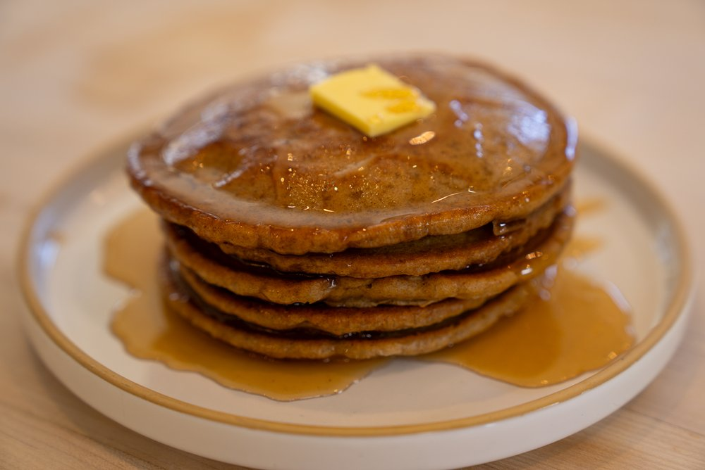

# Palacinke Low Carb, Keto Gluten Free

 

- [Palacinke Low Carb Video](https://www.youtube.com/watch?v=bNPJIOsGIzo&t=4s)
- [Palacinke Low Carba WebPage](https://www.lowcarblove.com/blog/3-ingredient-low-carb-pancakes)

 

  

#### Sastojci
- 2 eggs
- 1/2 tsp baking powder
- 3 tbsp almond butter or natural creamy peanut butter 

 

#### Directions:
1. In a medium bowl, beat the eggs until they become light and frothy (about 1-2 minutes). Stir in the baking powder.
2. Add your preferred nut butter and whisk until the mixture is smooth and well-combined.
3. Preheat a skillet or non-stick pan over medium heat and melt about 1 tbsp butter.
4. Pour the batter into the pan and cook until bubbles form on the surface, then flip and cook until golden brown on both sides. These pancakes cook much faster than regular keto pancakes, so I recommend testing with one first to make sure they stay soft and moist.
5. Serve immediately with your favorite toppings! 