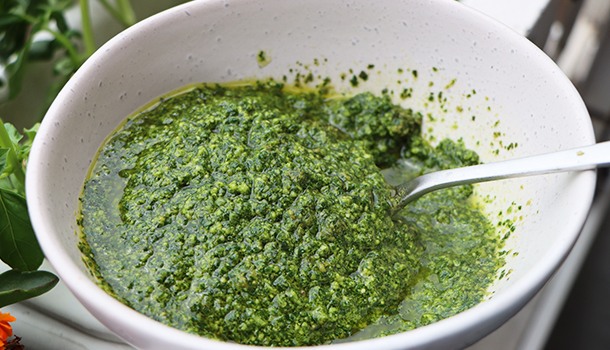

# Pesto Genovese

 

- [Pesto Genovese Video](https://www.youtube.com/watch?v=aF0S2ekE2r8)
- [Pesto Genovese WebPage](https://www.vincenzosplate.com/fresh-basil-pesto/)

 

  

## Description

Fresh basil pesto is so easy to make and one of the most versatile condiments in Italian cooking. It originated in the region of Liguria and when made fresh the salty flavour just dances on your tastebuds.
When making your own pesto at home, the trick is to use fresh basil leaves – either from your own garden, the farmers market or your neighbours!
Be warned, once you start blending the basil, your kitchen will be filled with the most delicious aroma and as soon as you combine the pine nuts and parmigiano you will not be able to resist a few scoops almost right away!

 

#### Sastojci

- Bosiljak - Basil
- 3 Table spoons - Extra virgin olive oil
- 10g Pinjoli - pine nuts 
- 3 table spoons Parmesan cheese
- pecorino cheese
- salt
- 1 garlic.

 

#### Directions:

1. Fresh basil pesto is all about the aroma, so if you have a basil plant at home, cut a bunch including the stalk as this will help the plant to grow back – fresh is always best!
2. Rinse the basil leaves in a bowl of water and make sure you get rid of any insects, then lay each individual leaf on a paper towel to dry.
3. To help dry the basil leaves for the fresh pesto place a paper towel on top of all them and press down very gently. This will help dry the leaves and absorb all the excess water.
4. Blend EVOO & garlic first until you get a smooth, creamy consistency before adding the pine nuts and blending again.
5. Next add basil leaves, pinch sea salt, 2 more tblsp EVOO and blend for 30 sec. If you find after this time there is still cheese all around the edges, scrape it off and into the fresh basil pesto and mix through using a tablespoon.
6. Using a small spoon, taste the fresh basil pesto for salt and flavour – if it is too salty, add a touch extra basil and EVOO and pulse blend until you’re happy with the taste.
7. Scoop it in a jar sealed tight and keep in the fridge, pairing it with delicious meals as often as you like!
8. E ora si mangia, Vincenzo’s Plate….Enjoy!

 

#### The Differences Between Parmesan and Pecorino
Pecorino and Parmesan are both aged, salty hard cheeses, but the main difference is that Pecorino is made with sheep’s milk and Parmesan is made with cow’s milk. 
Their aging times also differ: Pecorino is aged for a few months to a year, whereas Parmesan is aged anywhere from 12 months to 3 years (some U.S.-made Parmesan is aged for less than a year). 
Because Parmesan is aged longer, it is harder, drier, and has more of a nutty, sweeter flavor profile; some long-aged Parmesans also have mellow caramel notes. Pecorino, which is younger, tends to be softer and creamier, and tastes brighter, grassier and tangier.

