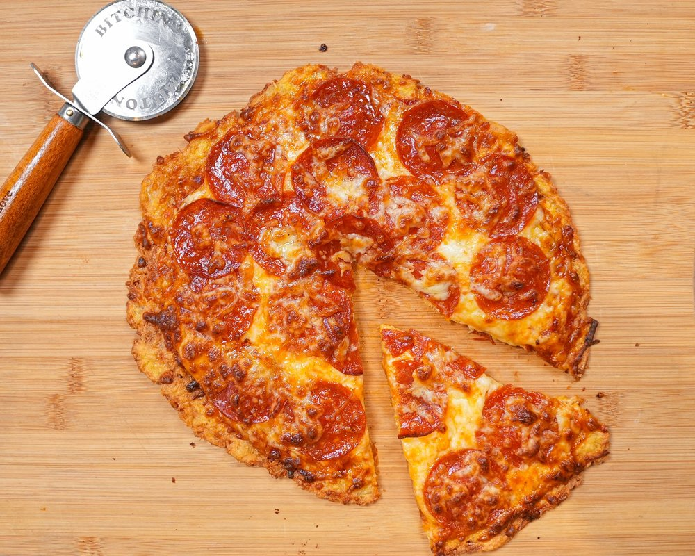

# Zero Carb crust pizza

 

- [Zero Carb pizza Video](https://www.youtube.com/watch?v=MfT4IcMz_qo)
- [Zero Carb pizza WebPage](https://www.lowcarblove.com/blog/zero-carb-crust-pizza)

## Description

Get ready for the most delicious and easy pizza crust you've ever tasted - and it's zero carbs! With just three simple ingredients, you can have a tasty and satisfying pizza in no time. This chicken crust recipe is perfect for those following a low-carb or ketogenic diet, and it's so easy to make. Follow along as I show you how to make this amazing pizza crust that's sure to become a new favorite.

 

  

#### Sastojci
- 300g chicken breast (drained)
- 1 egg
- 1/4 cup parmesan cheese 

#### Toppings:
- 1/3 cup unsweetened pizza sauce
- 1/2 cup mozzarella cheese
- 10-12 slices pepperoni

#### Directions:

- Start by opening your canned chicken and draining. 
    - You will want to get as much moisture out as possible because you want your crust to be crispy. 
    - I even used a clean kitchen towel to get as much water out as possible.
- In a medium sized bowl, add your chicken, cheese and egg.
- Add your crust to a parchment lined baking sheet  
- Bake the crust for 10 minutes at 475 degrees.
Remove crust and your toppings of choice! Bake for another 5-10 minutes. You can broil if you want your cheese super melty
Remove from oven and allow to cool for a few minutes and enjoy!

#### Nutrition:

Nutrition for (recipe):

- Calories - 382
- Fat - 21g
- Protein - 47g
- Total Carbs - 4.5g
- Fiber - 0.5g
- Net Carbs - 4g
