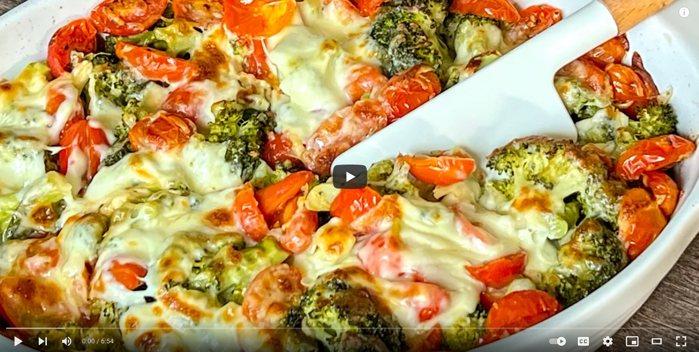

# Broccoli delicious

 

- [Broccoli delicious source](https://www.youtube.com/watch?v=huZmszHL4x0)

## Description

- Unsurprisingly, this is one of my all-time favorites: oven broccoli with tomato and cheese.
- Very healthy and tasty, everyone loves this recipe and I am very happy when I make it for the whole family.
- Cooking is very simple so anyone can do it. Just follow the simple steps and voila, dinner is ready and everyone is happy.

Try this easy, tasty and healthy recipe and tell us how you like it.

  

  

## Sastojci

- 3-4 broccoli.

***Cut and disassemble into inflorescences. Steam up to halfway.***  

- Tomatoes 200g.
- Cut each in half.
- Grate 2 cloves of garlic.
- Salt.
- Pepper.
- Olive oil.
Stir and let stand for 10 minutes.
Olive oil.
Put the broccoli in a tin.
Mix.
Add the tomatoes to the broccoli.
Grated mozzarella cheese 200 g.
Cut the mozzarella into slices.
Mozzarella 1 circle.
Olive oil.
In the oven / 15 minutes / 200C / 400F /.
