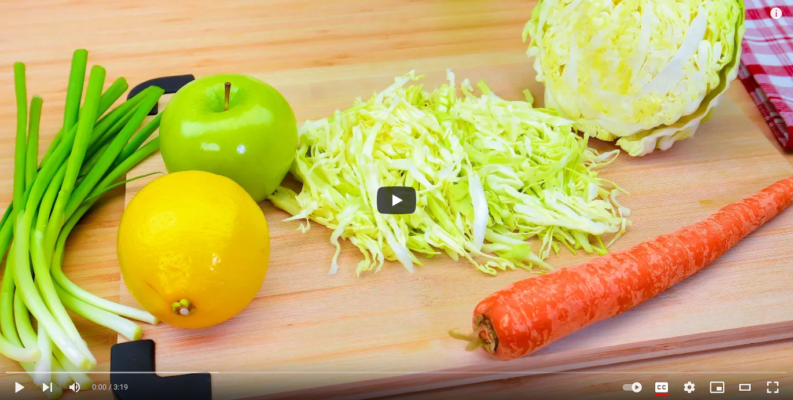

# Cabbage carrot apple salad recipe

 

- [cabbage carrot apple salad source](https://www.youtube.com/watch?v=R1_5kjjtkGY)

## Description

- This salad is very easy and ready in minutes. Recipe for cabbage, carrot and apple salad!
- Vegetable salad with apple! It's refreshing, crunchy, delicious and very healthy!
- If one of your goals this year is to lose weight and eat healthier, this salad could be one of your new favorites.
- It's delicious, fast and very healthy! Salad for those who are on a diet! Healthy eating is the key to health and energy!
- I hope you enjoy this simple and delicious recipe too! Bon appetit and have a nice day!❤️

 

  

## Sastojci

- 200-400 grams of cabbage
- 1 carrot
- 1 green apple
- spring onion
- dill or parsley (optional)
- lemon juice
- olive oil
- salt
