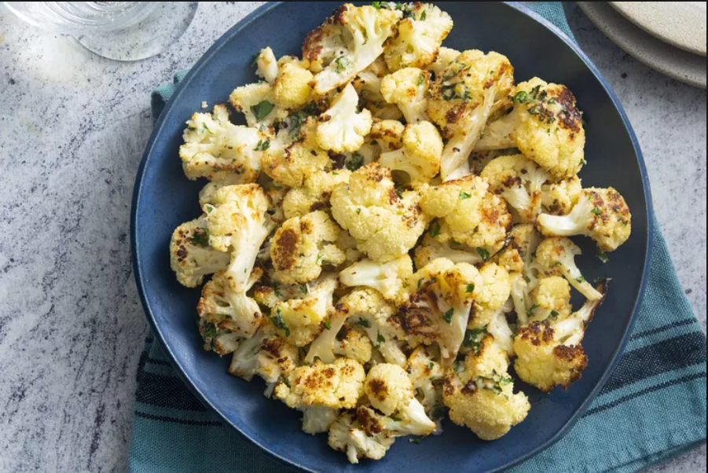
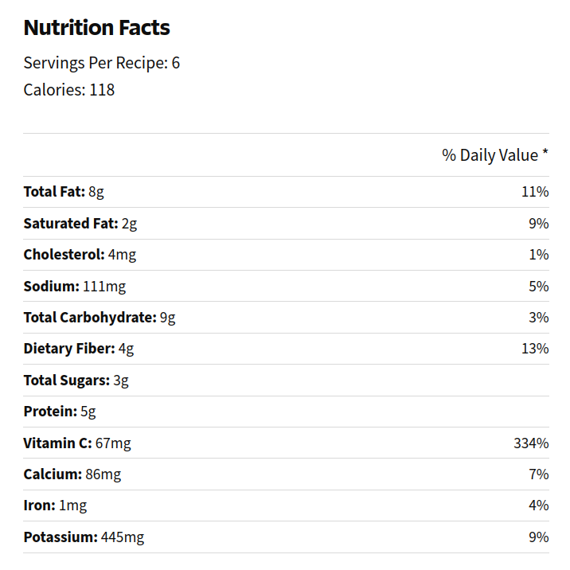

# Roasted Garlic Cauliflower

 

- [Roasted Garlic Cauliflower source](https://www.allrecipes.com/recipe/54675/roasted-garlic-cauliflower/)

## Description

- This easy cauliflower recipe is perfectly flavored with garlic and Parmesan cheese. 
- Your family will enjoy this tender, oven-roasted cauliflower with any meal.

  

  

## Sastojci

- 3-4 broccoli.

***Cut and disassemble into inflorescences. Steam up to halfway.***  

- 3 tablespoons olive oil
- 2 tablespoons minced garlic
- 1 large head cauliflower, separated into florets
- salt and ground black pepper to taste
- 1/3 cup grated Parmesan cheese
- 1 tablespoon chopped fresh parsley

Step 1:
Preheat the oven to 450 degrees F (220 degrees C). Grease a 9x13-inch casserole dish.

Step 2: 
Combine olive oil and garlic in a large resealable bag. Add cauliflower, seal the bag, and toss until cauliflower is coated. Pour into the prepared casserole dish and season with salt and pepper.

Step 3: 
Roast in the preheated oven for 25 minutes, stirring halfway through.

Step 4: 
Remove from the oven and turn on the broiler.

Step 5: 
Sprinkle Parmesan cheese and parsley over the cauliflower.

Step 6: 
Return to the oven and broil until golden brown, 3 to 5 minutes. 

