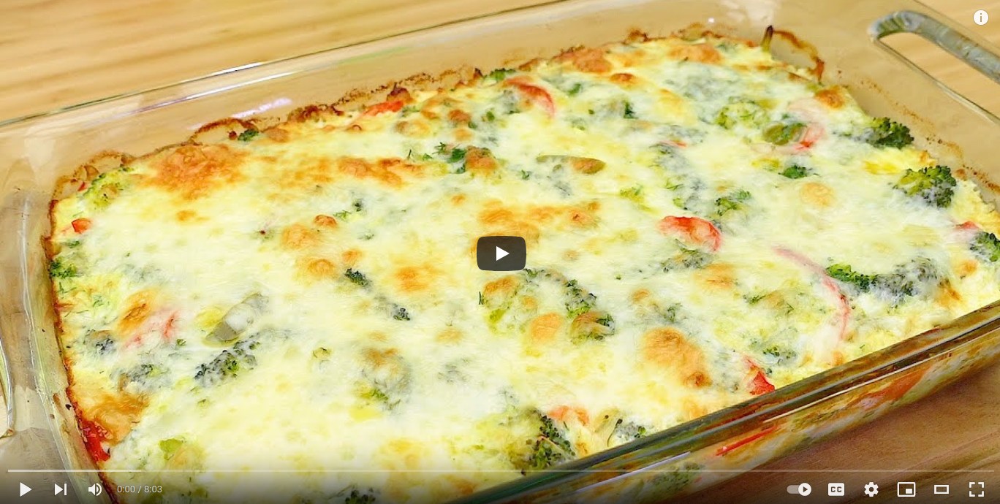

# Vegetable casserole recipe

 

- [vegetables_casserole source](https://www.youtube.com/watch?v=FDj5nf5AvZA)

## Description

- A simple casserole recipe! Baking broccoli with vegetables in the oven is quick and easy!
- Delicious dinner for the whole family!
- Baked vegetables So easy and so delicious! Diet dish made from broccoli eggs, pepper and cheese.
- Now that's how I cook broccoli! Oven vegetables - healthy recipes! Oven-baked vegetables are a dietetic dish.
- This vegetable dish will please everyone without exception! A quick and easy recipe!
- Vegetables will be tastier than meat, the family will be happy. Dinner!

 

  

## Sastojci

### Main ingredients
- Broccoli (1 kilogram)
- 1 teaspoon salt (8 grams)
- 1 tablespoon of milk
- 1 red pepper
- 1 green pepper
- 1 onion
- 3 tablespoons of olive oil (15 ml)

### Sauce
- 3 eggs
- 2 cups of milk (400 ml)
- 5 tablespoons of olive oil (30 ml)
- 4 tablespoons of multipurpose wheat flour (135 grams)
- 1 teaspoon salt (8 grams)
- 1 packet of baking powder (10 grams)
- dill

 

- For the above, Cheddar cheese (100 grams)

 

- Let's bake at 200 ° C for 25 minutes.

Bon Appetit!
