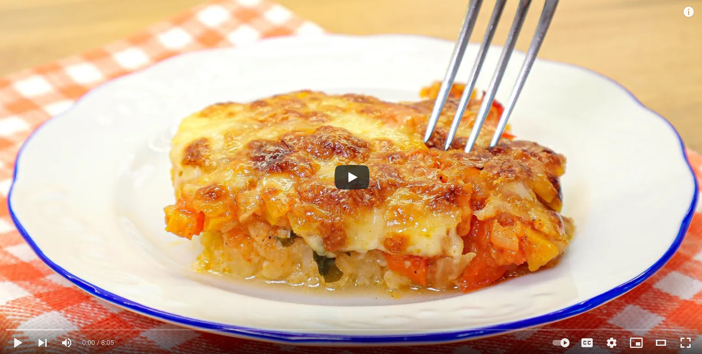

# Vegetarian Cauliflower recipe

 

- [vegetarian_cauliflower source](https://www.youtube.com/watch?v=ncVL5sijLnA)

## Description

Cauliflower bake! You will love cauliflower - a quick and healthy lunch recipe. This is a recipe with no egg, no meat and no frying cauliflower. A small amount of food and spices. This is a healthy recipe that will come in handy for you! Cauliflower casserole recipe perfect for lunch or dinner. Try a vegetarian recipe that you will love! Preparing vegetables with the new recipe is very easy! If you don't know how to cook delicious cauliflower, give this recipe a try. Cauliflower Casserole - A Healthy, Tasty, Easy Recipe! Now everyone is going to love cauliflower!

 

  

## Sastojci

- 1 cauliflower
- Salt 1 teaspoon.
- Caraway seed.
- B1 large onions or 2 small ones.
- Cut into small pieces.
- Vegetable fat.
- Roasted golden brown.
- 2 peppers.

***Let simmer for 5 minutes.***

- 2 tomatoes.
- Coriander.
- Salt.
- Black pepper.
- Garlic powder.
- Paprika.

***The cauliflower is soft. Done!
Drain the water. Add olive oil.***

- Parsley.
- 250 g mozzarella.

***Cook in the oven for 25 minutes at 250 degrees.***

Bon Appetit!
