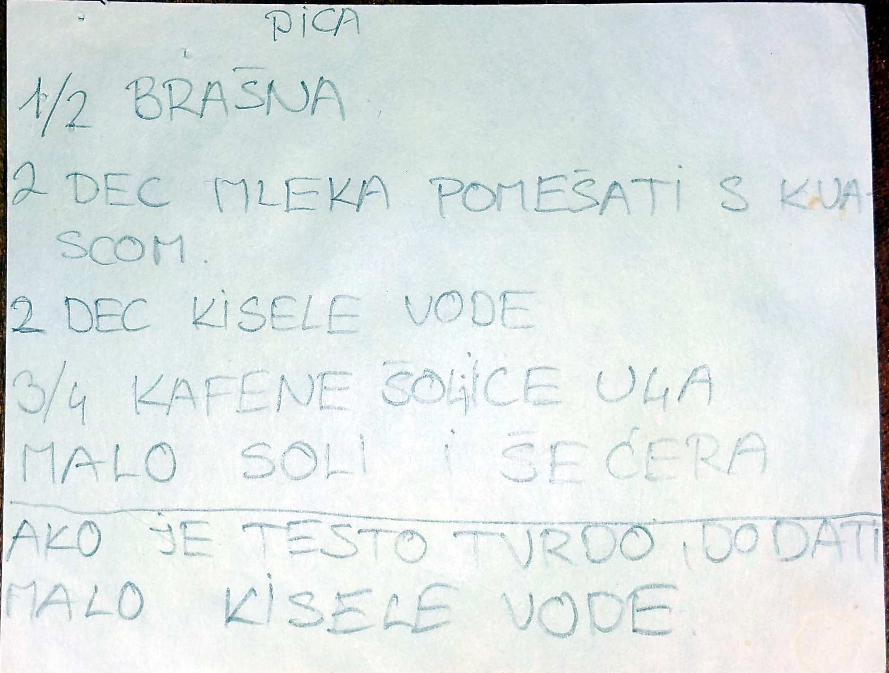

# Pica testo

## Sastojci

- 500g Brasna
- 150 decilitra mleka
- 2 decilitra kisele vode
- 3/4 kafene solje ulja (70 ml)
- 1 kasicica soli
- 1 kasicica secera
- 15 gr kvasca (3-4 gr suvog)

## Priprema testa za picu

NOTE:
Ne mesati so i kvasac direktno - prvo voda sa malo brasna i onda kvasac.  

- U toplu vodu izmrviti kvasac i dodati šećer pa izmešati.
- Dodati pola brašna i skoro svo ulje, ostaviti malo da se poulji okolo testo, kad se umesi i so, pa izmešati dobro varjačom.
- Kako dodajete ostatak brašna, tako i mešajte.
- Kada testo već skoro ne može da se meša varjačom lagano ga rukom izmesite, samo da ga uobličite.
- Nije potrebno dugo mešenje jer je testov eć dobro izradjeno varjačom.
- Pouljite ostatkom ulja i ostavite da kisne 30 minuta.
- Testo će biti mekano i lepljivo.
- Pospite brašnom sto pa izvadite nakislo testo i lagano ga premesite.
- Od ove mere ima testa za dve veće okrugle tepsije.
- Testo je mekano i može da se razvuče rukama  i postavi u tepsiju.
- Nafilujte ga po želji i pecite na najjačoj temperaturi koju imate i skroz dole.

Prijatno

  

