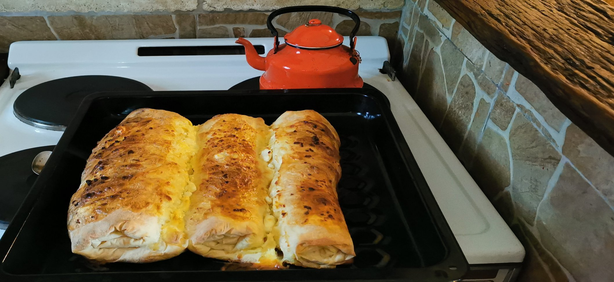
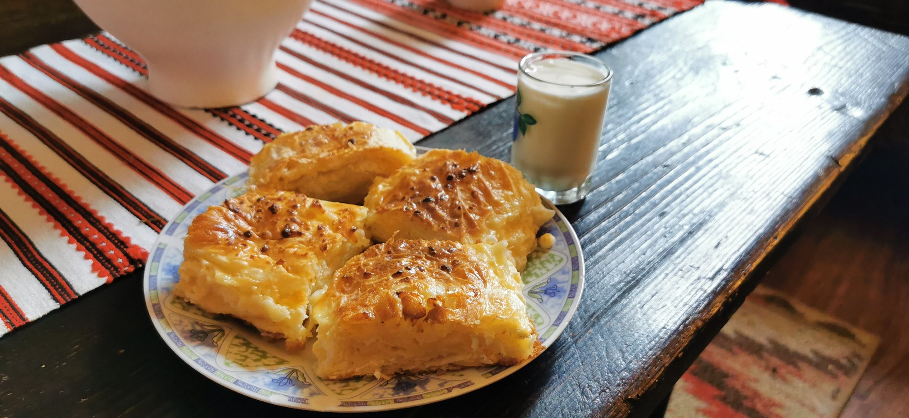

# Gagina Brza Pita sa sirom

#### Uvod

ToDo

#### Sastojci

- 500g sitnog sira za pitu
- 4 jajeta
- 1 decilitar Jogurta
- 1 decilitar Ulja
- 1 decilitar Kisele Vode (opciono)

 

#### Recept

1. U posudu dodati mileram ili punomasno kiselo vrhnje 20% mm ili creme fraiche, ulje, jaje i sol. Točne količine su navedene gore na vrhu stranice u popisu sastojaka i video receptu
2. Sve dobro promiješati
3. Gotove ili kupovne kore sa savijače i pite imaju oko 10-12 komada listova u paketu. Uzeti dvije kore odnosno dva lista pa premazati sa mješavinom sa mileramom kako je prikazano gore u video receptu
4. Dodati oko 80g sira ali onako da budu male “hrpice” ili kupovi jer onda se na kraju taj siri vidi, ne otopi se pa da ga upiju kore. Upravo tako preporučujem da i vi napravite
5. Zamotati pa poslagati na prethodno namašćen ili pouljen lim. Sa ovom količinom bi trebali dobiti 6 komada savijača sa sirom
6. Premazati sa otopljenim maslacem i peći pola sata na 200 C
7. Nakon proteka vremena i nakon što je savijača sa sirom pečena, potrebno je ohladiti barem 15 minuta kako bi se slegnula i kako bi prilikom konzumacije okus više došo do izražaja

