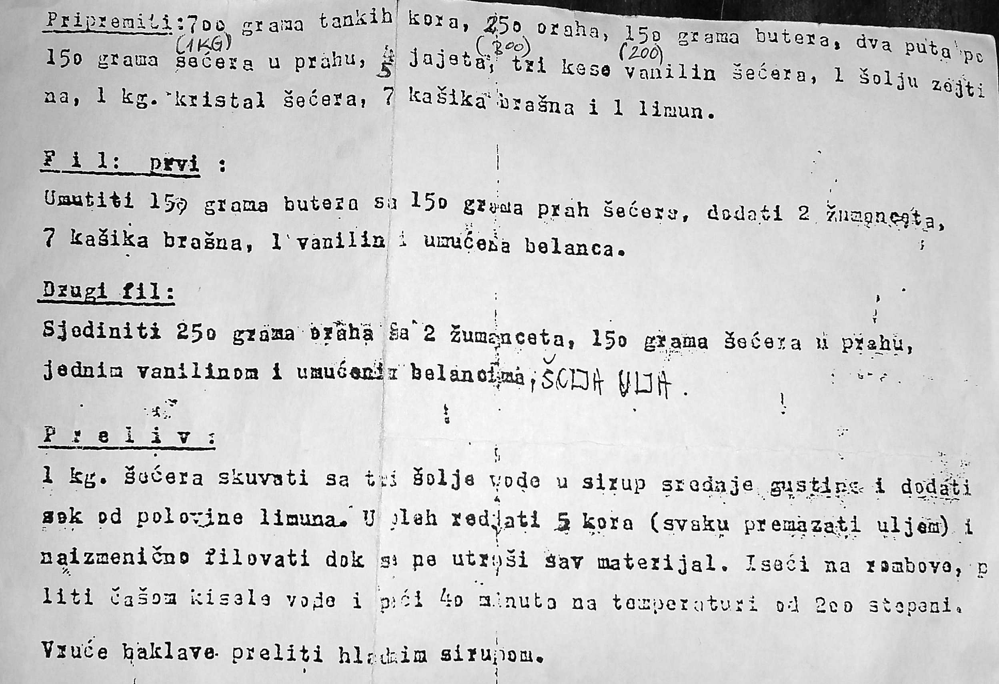

# Novogodisnja Baklava

## Sastojci

- 700 g tankih kora
- 250 g oraha
- 150 g putera
- 300 g šećera
- 4 jajeta
- 3 paketića vanilin šećera
- 1 šolja ulja
- 1 kg kristal šećera
- 7 kašika brašna
- 1 limun

 

## Priprema

- Prvo skuvati dva fila i sirup.

 

### Prvi fil

- Umutiti 150 g putera sa 150 g šećera u prahu.
- Umućenoj masi dodati
  - dva žumanceta,
  - 7 kašika brašna,
  - 1 paketić vanil šećera i na kraju
  - sneg od dva belanceta.

 

### Drugi fil

- Sjediniti mlevene orahe sa
- dva žumanceta i
- 150 g šećera u prahu
- zatim dodati 1 paketić vanil šećera i
- čvrst sneg od dva belanceta.

 

### Sirup

- 1 kg šećera skuvati sa
- tri šolje vode u sirup srednje gustine, a zatim dodati
- sok od jednog limuna i
- jedan paketić vanil šećera.

Sirup sklonuti sa vatre ii ohladiti ga.

 

### Pecenje

- Dno tepsije bočne strane premazati uljem, 
- uzeti pet kora i svaku poprskati uljem te složiti jednu preko druge.
- Sada staviti prvi fil pa kore, pa drugi fil pa kore. Tako naizmenično filovati dok se sve ne potroši. 
- Baklavu iseći na kocke ili rombove i preliti jednom čašom mineralne vode. 
- Peći oko 40 min. na 200°C.
- Pečenu i još toplu baklavu preliti hladnim sirupom.

 

