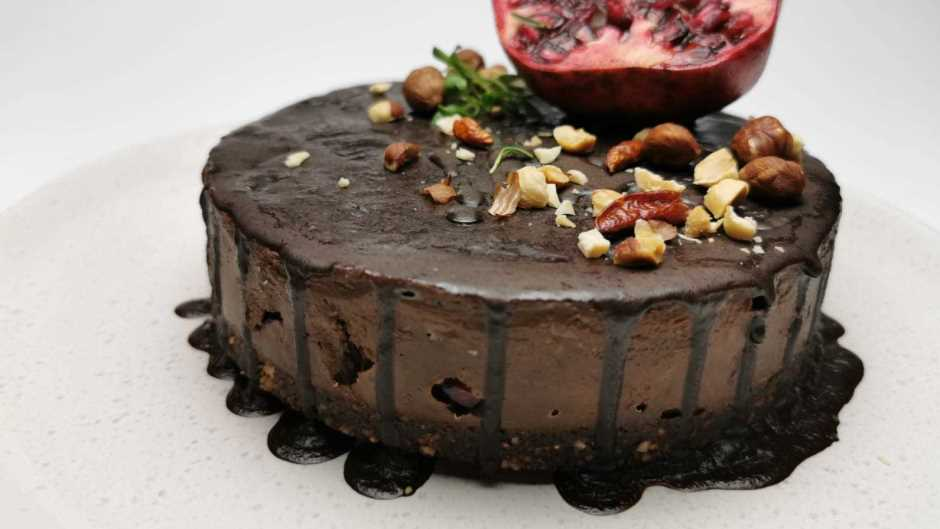

# Crna Mamba - Jovana

 

- [Source](https://rs.n1info.com/cooking/a564784-crna-mamba/)

- Za ljubitelje slatkiša, jedna mala, slatka, torta bez secera.

 

  

## Sastojci za (18cm):

### Za koricu:

- 20g kakaa (2 kasike)
- 130g urmi (12-13 komada)
- 100g lešnika
- Malo mlevenog crnog bibera

 

### Za fil:

- 300g avokada (2 kom)
- 4 kašike kakaa (40g)
- 6 kašika agavinog sirupa
- 4 kašika kokosovog ulja
- prstohvat soli
- male ljute sušene kajenske papričice
- 1/2 nara

 

### Za glazuru:

- Kokosovo ulje
- Kakao
- Agavin sirup

 

### Priprema:

- Suve sastojke za koricu usitniti u secku ili blenderu, pa dodati urme. Kada smesa postane lepljiva, spremna je za tapkanje u kalup za tortu.

- Fil se priprema tako što se avokado blendira dok ne postane glatka masa. Ubace se i ostali sastojci, osim nara i nastavlja blendiranje. Kada masa bude homogena i bez grudvica ubacuje se nar i promeša kašikom.

- Tako dobijena masa se prelije preko korice i zamrzne. Pola sata pre sečenja izvaditi tortu iz zamrzivača.