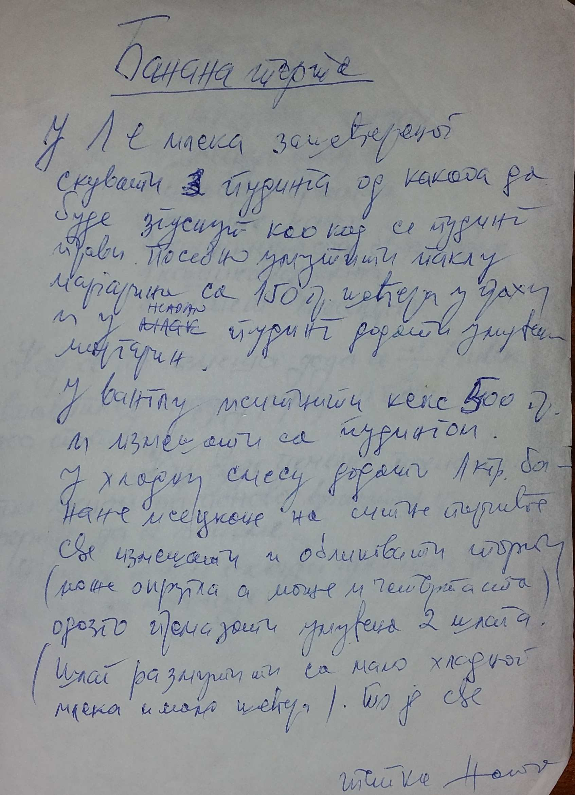

# Banana Torta (rolat)

## Prvi fil (Skuvati puding)

- 1 lit mleka,
- 3 pudinga od vanile ili cokolade,
- Malo šećera

## Drugi fil

- 150 g Secera u prahu
- 200 gr maslaca

## Treca faza

- Sjediniti "Prvi" fil (Hladan puding) sa "Drugim" filom

## Na kraju sve sjediniti sa

- 400 gr plazma keksa
- 700 gr banana (može i po želji)

 

#### Priprema

- Napraviti puding (3 kesice pudinga) i ohladiti.
- Umesati 150 g Secera u prahu i 200 gr maslaca
- Sjediniti ohladjen puding i smesu od secera i maslaca.

- Na kraju, u pripremljenu smesu, dodati keks i banane.
- Oblikovati po zelji.
- Opciono, moze se staviti slaga po zelji

  

