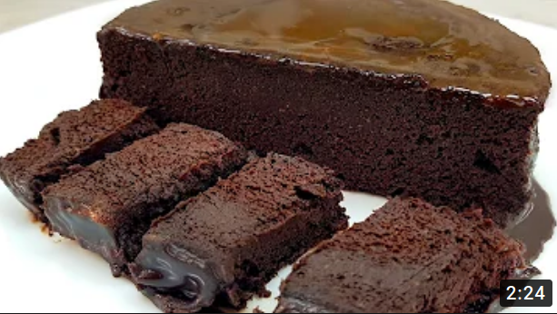

# Sugar and flour free Chocolate cake

 

- [Recipe video by Leckere Minute](https://www.youtube.com/watch?v=ZWUjZ2diOsc)

 

Sugar and flour free! Chocolate cake in 5 minutes preparation - mixed in 1 minute and in the microwave. Light and simple cake without an oven. How to cook a cake in the microwave in 5 minutes - see my video. A very simple and quick recipe for making tea in 5 minutes. A cake without sugar and flour in minutes. The main thing is to cook in a good mood!

 

## Recipe and ingredients

- 2 bananas
- 2 eggs
- 4 tablespoons of cocoa
- 1/2 teaspoon baking powder
- Cake pan 14 cm
- Bake in the microwave for 5-8 minutes

## Dressing

- 50 g chocolate + 45 ml milk + 15 g butter

  

