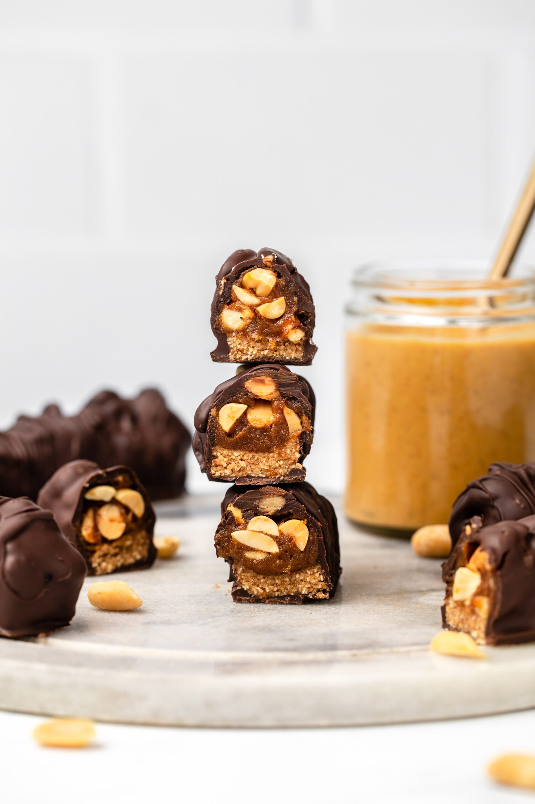

# Vegan Snickers Bars - Suzic

 

- [Source](https://frommybowl.com/healthy-snickers-bars/)

 

 

This recipe requires only about 20 minutes of hands-on time – the longest part is waiting for the nougat and caramel layers to set in the freezer!

- Soak your medjool dates, then blend them with peanut butter, vanilla, and salt to make a caramel.
- Mix a portion of the caramel with some oat flour to make the nougat layer
- Layer the nougat and caramel with some peanuts, freeze until firm, then slice to make bars.
- Dunk in chocolate, then serve and enjoy!

 

  

## Sastojci za (18cm):

### For the Caramel Layer:

- 2 tablespoons creamy peanut butter
- 1 teaspoon vanilla extract
- 1/4 teaspoon salt

 

### For the Nougat:

- 1/4 cup (75 g) date caramel, above
- 2/3 cup (68 g) oat flour*

 

### To Finish:

- Kokosovo ulje
- Kakao
- Agavin sirup
- 1/2 cup (70 g) unsalted dry roasted peanuts
- 8 ounces (225 g) high-quality vegan chocolate (see notes)

  

### Priprema:

- Prep: Transfer the pitted dates to a larger bowl and cover with hot water. Soak for 5-10 minutes, depending on how soft they were to begin with. You can also just cover the dates in water and microwave for 80 seconds if you want to be efficient. Drain the dates, but reserve the water for step 2. Line a baking sheet or cooling rack with parchment paper to place the completed bars on (step 6) and set aside.

- Make the Caramel: Drain any excess liquid off of the dates (they should be relatively moist, but not dripping) and add them to a food processor with an S-blade. Add in the peanut butter, vanilla, and salt. Process until thick and smooth, scraping the sides of the device if necessary. If the mixture is too thick, add in the reserved date water in 1 tablespoon increments until you get an evenly smooth mixture.

- Make the Nougat: Remove the date “caramel” from the food processor. Add the oat flour to the food processor (no need to rinse) with 1/4 cup (75 g) of the caramel and process until well incorporated. This should form a slightly sticky “dough” that will hold together when you pinch it.

- Assemble & Freeze: Firmly and evenly press the nougat into a small and narrow container (see notes). Use a spatula to spread the remaining caramel evenly over the nougat, then sprinkle the peanuts on top. Use your fingers to press the Peanuts into the Caramel layer, so they stick. Place this in the freezer for 60 to 90 minutes, until firm.

- Make Bars: Remove the frozen “filling” from it’s container, then use a sharp knife to cut it into bar-sized pieces. Return these to the freezer while you melt your chocolate. Melt your Chocolate using either a double boiler or the microwave:
    - Double-Boiler: fill a small pot with 1-2″ of water, then place a glass bowl over the top. Bring the water to a simmer over high-heat, then reduce the heat to medium-low. While the water is warming, add the chocolate to the glass bowl. Use a clean and dry spatula to stir frequently, until the chocolate is around 80% melted. Then, carefully remove the bowl from the pot. Stir with the spatula until completely melted.
    - Microwave:  Place your chocolate pieces in a glass bowl and microwave at 30 second intervals, stirring in between. Once the chocolate is around 75% melted, stop microwaving and stir the mixture with a spatula until completely melted.

- Chocolate: Moving quickly, place 1 candy bar into the bowl of melted chocolate. Use two forks to “flip” the bar, until it is coated in chocolate on all sides. Remove the bar from the melted chocolate, letting any excess chocolate drip off. Then, place it onto the prepared baking sheet and repeat with the remaining bars.

- Serve: Place the bars in the fridge for 5 to 10 minutes, to allow the chocolate to harden. Serve and enjoy! Bars are best stored in the refrigerator and will last there for up to 10 days. You can also place them in the freezer, where they will last for up to one month – just let the bars thaw for 5 or so minutes before enjoying.

  

### Notes

- Mould: I used a narrow silicone mold that actually fits in my bento box. However, you can use any narrow dish that you would like (such as a loaf pan, or even a square or rectangular tupperware). If your dish is not flexible, I would recommend lining it with parchment paper before you add the filling layers into it, so they will be easy to remove once frozen.

- Chocolate: I would recommend using a chopped up chocolate bar for this recipe unless you can guarantee that your chocolate chips are wax-free (which manufacturers are not required to disclose on the label). If you do opt to use chocolate chips and find the mixture to be too thick, add 1-3 teaspoons of refined coconut oil while melting to help thin it out. Use a dark chocolate for a less-sweet finish.

- Oat Flour: Your oat flour should be very fine (almost like regular flour) for best results. I recommend you use a blender (not a food processor) and process for at least 45 seconds.

- Nut-Free: If you cannot eat peanuts due to an allergy or preference, you can substitute the PB with any nut or seed butter of choice – same goes for the whole nuts in the bars. Obviously the final result will taste different, but still be delicious! I would recommend cashew or almond butter.

- Update: The original recipe added an optional 1 teaspoon of maca powder, which you can still add if you wish – but we found that the added “caramel” flavor was minimal.

  

 

 

